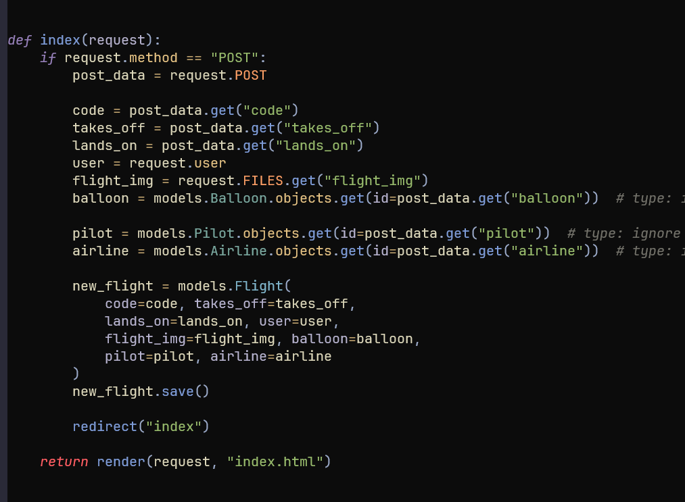
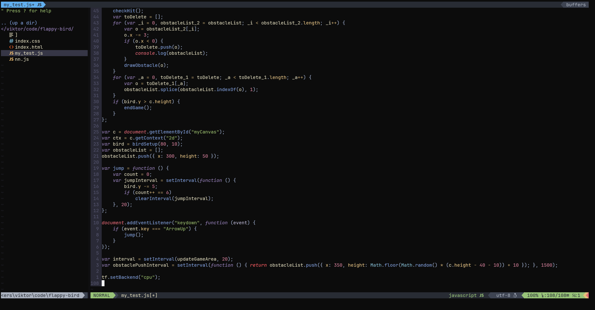
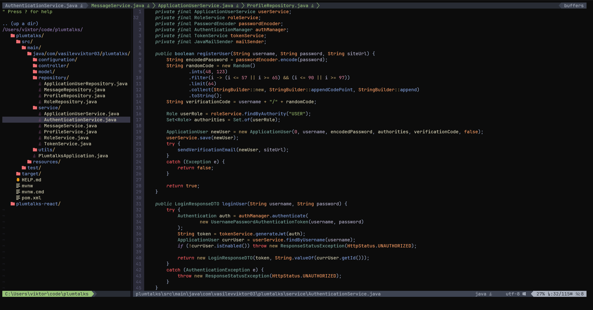

# nvim-config
my neovim config
using vim-plug (i know)

features:
- lsp configuration (installed using mason package manager):
  - java (jdtls) (cool mappings under " jdtls Mappings)
  - typescript, javascript (typescript-language-server)
  - python (pyright)
- linters:
  - flake8 for python (really strict)
- treesitter (highlighting) configuration for:
  - java
  - lua
  - python
  - html
  - typescript (javascript)
- autocompletion for languages that are lsp configured
- auto-pairing for tags, braces, quotes
- telescope plugin (mappings under " Telescope Mappings)
- kanagawa colorscheme
- code snippets (configured in snippets directory)
- airline (of course)
- nerdtree (toggle on: C-f)
- multiline insert (using vim-visual-multi)

:blush: forbidden: blue backgrounds. :blush:

screenshot 1:

screenshot 2:

screenshot 3:

